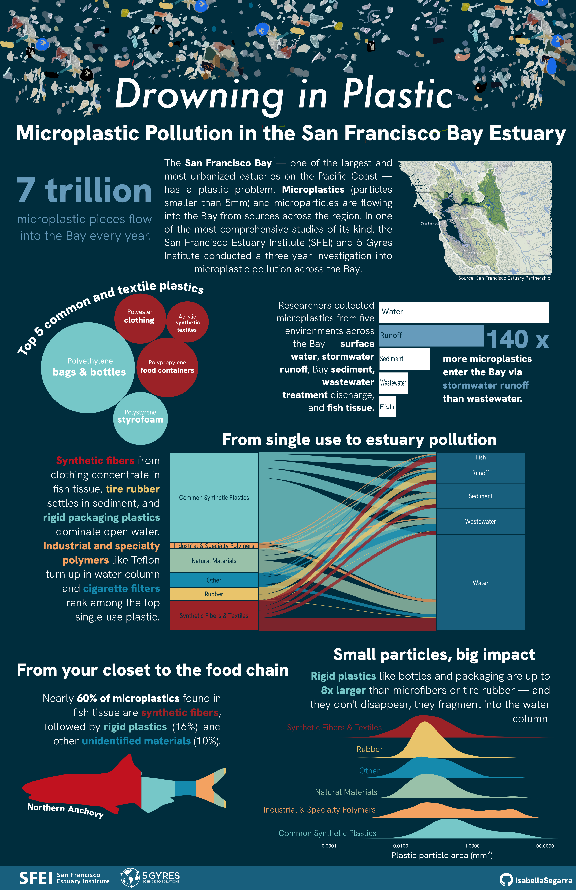
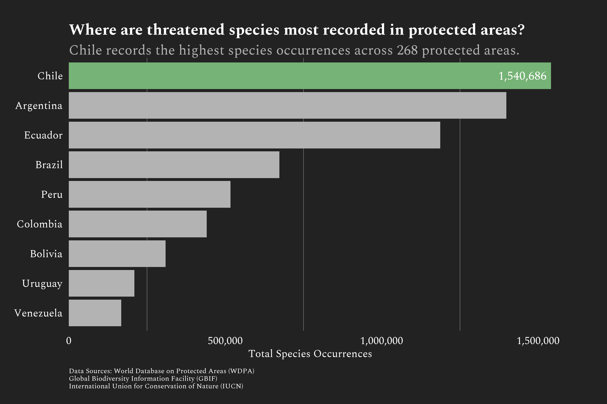

# Explore my portfolio

## Visualizations
I love creating stories from data.

::: {.gallery}

  <!-- Microplastics Infographic -->
  <a href="#microplastics" class="lightbox-thumbnail">
    {.thumbnail}
  </a>

  <!-- GBIF Threatened Species Infographic -->
  <a href="#gbif-species" class="lightbox-thumbnail">
    {.thumbnail}
  </a>

  <a href="#" class="close">X</a>
  <a href="#gbif-species" class="next">→</a>
  

  
  
Infographic charts created in R studio and assembled with Affinity Designer. Data from San Francisco Estuary Institute and 5 Gyres Institute.

  <a href="#" class="close">X</a>
  <a href="#microplastics" class="next">→</a>
  

  
  
 Bar chart of threatened species observations in South America. Data from GBIF (Global Biodiversity Information Facility).

::: 

## Interactive 

#### BirdWatch Storymap
<iframe src="https://petervitale910.shinyapps.io/shiny_dashboard/" 
        width="100%" height="500" frameborder="0" allowfullscreen allow="geolocation"></iframe>
        
#### Water Quality Monitoring Storymap
<iframe src="https://storymaps.arcgis.com/stories/9ea6810b647b4408946fa9e628f55879" 
        width="100%" height="500" frameborder="0" allowfullscreen allow="geolocation"></iframe>
        
## Publications
<iframe src="https://ucnature.org/wp-content/uploads/2022/09/Burn-severity-and-community-structure-affect-tanoak-and-California-bay-laurel-regrowth.pdf" 
        width="100%" height="500" frameborder="0" allowfullscreen allow="geolocation"></iframe>

