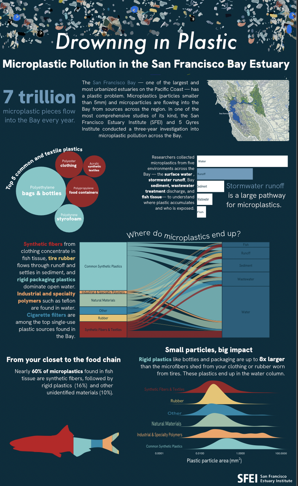

## Seven Trillion Pieces and Counting

My motivation for this piece started with a simple question: "What do we actually know about plastic pollution in California?" That search led me to a dataset from the San Francisco Estuary Institute, a comprehensive three-year study on microplastic and microparticle pollution in the San Francisco Bay Estuary. I read the executive summary, scrolled through 400+ pages of its associated technical reports, and thought it would be interesting to bring the findings of this study to life.

## The infographic 
For my infographic, I wanted to answer the following questions:

*Overarching question*: What are the sources and composition of microplastics in the SF Bay Estuary?

*Additional question 1.* What types of plastic dominate in each sampling environment?

*Additional question 2.* What is the size distribution of microplastic particles across plastic types? 

*Additional question 3.* What plastic types are found in fish tissue?

*Additional question 4* What sampling environments had the most microplastics? 



## Translating polyethylene into plastic bags
Scientific studies on plastic pollution don't talk about styrofoam, they talk about *polystyrene*. As someone with no background in the technical language of microplastics, one of my biggest challenges was translating dense scientific terminology into something myself and a general audience could understand. This challenge felt worthwhile, after all the San Francisco Bay is one of the most urbanized estuaries in the world, and the people living around it are part of the ecosystem too, contributing to the microplastics of this study. 

## Visual elements
To visualize the findings of this study, I used the technical report as a guide for what to highlight, but I also let the data speak for itself. The goal was five visualizations, each simple enough to stand alone while together telling a complete story about microplastics. 

A main challenge of this piece was balancing the visual elements. I decided to place the alluvial graph center since it takes up the most space and include the surrounding elements as additional information. 

Much of the data was categorical and I originally had specific colors for each sample medium. I decided to limit to six main colors for the plastic types I am using to tell this story in order to lead to less visual clutter as well as home in on the main theme of this piece. 

*All visualizations were made with {ggplot2} and arranged in Affinity designer.*

## The code
```{r}
#| eval: false
#| echo: true
#| code-fold: true

##~~~~~~~~~~~~~~~~~~~~~~~~~~~~~~~~~~~~~~~~~~~~~~~~~~~~~~~~~~~~~~~~~~~~~~~~~~~~~~
##                                                                            --
##--------------------------- #......SET UP......-------------------------------
##                                                                            --
##~~~~~~~~~~~~~~~~~~~~~~~~~~~~~~~~~~~~~~~~~~~~~~~~~~~~~~~~~~~~~~~~~~~~~~~~~~~~~~

library(tidyverse)
library(tidyr)
library(here)
library(dplyr)
library(janitor)
library(readxl)
library(ggplot2)
library(stringr)
library(ggalluvial)
library(ggtext)
library(showtext)
library(glue)
library(packcircles)
library(ARTofR)
library(ggridges)
library(ggforce)

#.......Import data......

micro_plastics <- read_excel(here("posts/microplastics-sf-bay/data/2020-09-11_microparticledata.xlsx")) %>% 
  # Change all columns to lower_snack_case 
  clean_names() 

#.....Clean data with function....
source(here("posts/microplastics-sf-bay/R/clean_data_function.R"))
micro_plastics_clean <- clean_microplastics(micro_plastics)

#.......Fonts.......
font_add_google("Hanken Grotesk", "hanken")

#.....Establish palettes.....
my_pal <- c(
"Other"                                    = "#168aad",
"Common Synthetic Plastics"                = "#76c8c8",
"Industrial & Specialty Polymers"          = "#f4a261",
"Natural Materials"                        = "#99c1a9",
"Rubber"                                   = "#e9c46a",
"Synthetic Fibers & Textiles"              = "#9B2226",
"Unidentified plastic"                     = "#6c757d"
)

plastic_pal <- c(
  "Polyethylene"  = "#76C8C8",  
  "Polypropylene" = "#9B2226",  
  "Polystyrene"   = "#76C8C8",  
  "Polyester"     = "#9B2226",  
  "Acrylic"       = "#9B2226"   
)
#........Enable showtest.....
showtext_auto(enable = TRUE)

##~~~~~~~~~~~~~~~~~~~~~~~~~~~~~~~~~~~~~~~~~~~~~~~~~~~~~~~~~~~~~~~~~~~~~~~~~~~~~~
##                                                                            --
##--------------------------- #......Graphs......-------------------------------
##                                                                            --
##~~~~~~~~~~~~~~~~~~~~~~~~~~~~~~~~~~~~~~~~~~~~~~~~~~~~~~~~~~~~~~~~~~~~~~~~~~~~~~

#........Bubble chart........

# Create top plastics df 
top_plastics <- micro_plastics_clean %>%
# Filter out certain plastics - these are all "natural"
  filter(!plastic_type %in% c("Not Characterized", "Unknown",
                               "Anthropogenic (unknown base)",
                               "Anthropogenic (cellulosic)",
                               "Unknown Potentially Rubber",
                               "Anthropogenic (synthetic)",
                               "Inorganic natural material",
                               "Stearates, Lubricants, Waxes",
                               "Cotton")) %>%
  count(plastic_type, sort = TRUE) %>%
  head(5) %>%
  mutate(circleProgressiveLayout(n, sizetype = "area"),
         label = paste0(plastic_type))

top_plastics_plot <- ggplot(top_plastics, aes(x0 = x, y0 = y)) +
  geom_circle(aes(r = radius, fill = plastic_type), color = NA) +
  geom_text(aes(x = x, y = y, label = label),
            color = "white", family = "hanken", size = 3.5) +
  coord_equal() +
  scale_fill_manual(values = plastic_pal) +
  theme_void() +
  theme(
    legend.position = "none",
    panel.grid.major = element_blank(),
    plot.background = element_rect(fill = "#002d3d", color = NA),
    panel.background = element_rect(fill = "#002d3d", color = NA)
  )

top_plastics_plot

#........Top plastics per sample medium bar chart........
total_n_plastics <- micro_plastics_clean %>%
  filter(!is.na(sample_medium)) %>%
  count(sample_medium, sort = TRUE) %>%
  mutate(
    sample_medium = fct_reorder(sample_medium, n)
  ) %>%
  ggplot(aes(x = sample_medium, y = n)) +
  geom_col(fill = "white") +
  geom_text(aes(label = scales::comma(n)), 
            hjust = -0.2, color = "white", 
            family = "hanken", size = 3.5) +
  labs(x = "Sampling environment", 
       y = "Number of microplastics found", 
       title = "What sampling environments had the most microplastics?",
       caption  = "Data Source: San Francisco Bay Estuary Institute (SFEI)") + 
  scale_y_continuous(expand = expansion(mult = c(0, 0.15))) +
  coord_flip() +
  theme_minimal(base_size = 13) +
  theme(
    legend.position = "none",
    axis.title.y = element_text(color = "white", family = "hanken"),
    axis.text.y  = element_text(color = "white", family = "hanken"),
    plot.title = element_text(color = "white", family = "hanken", face = "bold", hjust = 0.5),
    axis.text = element_text(color = "white", family = "hanken"),
    axis.title.x = element_text(color = "white", family = "hanken"),
    plot.caption = element_text(color = "white", family = "hanken"),
    panel.grid = element_blank(),
    panel.background = element_rect(fill = "#002d3d", color = NA),
    plot.background = element_rect(fill = "#002d3d", color = NA)
  )

total_n_plastics

#........Alluvial graph........
alluvial_plot <- micro_plastics_clean %>%
  filter(material_type_refined != "Unidentified plastic") %>% 
  filter(!is.na(material_type_refined), !is.na(sample_medium)) %>%
  count(sample_medium, material_type_refined) %>%
  # Plot 
  ggplot(aes(axis1 = material_type_refined, axis2 = sample_medium, y = n)) +
  geom_alluvium(aes(fill = material_type_refined),
                alpha = 0.8, 
                curve_type = "cubic") +
  scale_fill_manual(values = my_pal) +
  geom_stratum(aes(fill = material_type_refined), width = 1/3, color = "#002d3d") +
 geom_text(stat = "stratum", aes(label = after_stat(stratum)),
          family = "hanken", color = "#002d3d", size = 3.5) +
  scale_x_discrete(limits = c("Plastic type", "Sample medium"), expand = c(0.12, 0.1)) +
  labs(x = NULL, y = NULL, fill = "Plastic Type", 
       title = "Sources of Microplastics in the San Francisco Bay Estuary",
       subtitle = "Rigid synthetic polymers dominate microplastic composition across all sampling locations.", 
       caption = "Data: San Francisco Bay Estuary Institute") +
  theme_void() +
  theme(
        legend.position = "bottom",
        legend.title = element_text(color = "white", family = "hanken"),
        legend.text = element_text(color = "white", family = "hanken"),
        plot.title = element_text(color = "white", family = "hanken", 
                              face = "bold", 
                              hjust = 0.5),
        plot.subtitle = element_text(color = "white", family = "hanken", hjust = 0.5, size = 9),
        plot.caption = element_text(color = "white", hjust = 1, family = "hanken"), 
        axis.ticks.y = element_blank(),
        axis.text.y = element_blank(),
        axis.title.x = element_text(color = "white", family = "hanken", size = 4),
        panel.grid.major.y = element_blank(), 
        plot.margin = margin(t= 1, r = 1, b =1, l = 1, "cm"), 
        panel.border = element_blank(),
         panel.background = element_rect(fill = "#002d3d", color = NA),
    plot.background = element_rect(fill = "#002d3d", color = NA)
        ) 

alluvial_plot

#........Fish Bar chart.......
fish_pct_plot <- micro_plastics_clean %>%
  filter(sample_medium == "Fish", !is.na(material_type_refined),
         material_type_refined != "Unidentified plastic") %>%
  count(material_type_refined) %>%
mutate(pct = n / sum(n) * 100,
       material_type_refined = fct_reorder(material_type_refined, pct)) %>% 
  ggplot(aes(x = 1, y = pct, fill = material_type_refined)) +
  geom_col() +
  geom_text(aes(label = paste0(round(pct, 0), "%")),
            position = position_stack(vjust = 0.5),
            color = "white", family = "hanken", size = 3.5) +
  scale_fill_manual(values = my_pal) +
  coord_flip() +
  labs(x = NULL, y = "Percentage (%)",
       title = "Types of plastic found in fish tissue",
       fill = "Plastic Type",
       caption = "Data Source: San Francisco Bay Estuary Institute (SFEI)") +
  theme_minimal() +
  theme(
    axis.text.y = element_blank(),
    axis.ticks.y = element_blank(),
    plot.title = element_text(color = "white", family = "hanken", face = "bold", hjust = 0.5),
    axis.text.x = element_text(color = "white", family = "hanken"),
    axis.title.x = element_text(color = "white", family = "hanken"),
    legend.text = element_text(color = "white", family = "hanken"),
    legend.title = element_text(color = "white", family = "hanken"), 
    panel.grid = element_blank(),
    plot.caption = element_text(color = "white", family = "hanken"),
    panel.background = element_rect(fill = "#002d3d", color = NA),
    plot.background = element_rect(fill = "#002d3d", color = NA)
  )

fish_pct_plot

#........Density Ridge plot.......

density_ridge_plot <- micro_plastics_clean %>%
  filter(!is.na(material_type_refined), !is.na(area_mm), area_mm > 0) %>%
  group_by(sample_medium) %>%
  filter(material_type_refined != "Unidentified plastic") %>% 
  filter(n() > 30, area_mm <= quantile(area_mm, 0.95)) %>%
  ungroup() %>%
  ggplot(aes(x = log10(area_mm), y = material_type_refined, fill = material_type_refined)) +
  geom_density_ridges2(alpha = 1, color = NA) +
  scale_fill_manual(values = my_pal) +
  scale_x_continuous(labels = function(x) scales::label_number()(10^x)) +  # convert log back to readable labels
  labs(
    title    = "Which plastics are the largest?",
    #subtitle = subtitle,
    x        = "Plastic particle area (mm²)",
    y        = NULL,
    caption  = "Data Source: San Francisco Bay Estuary Institute (SFEI)"
  ) +
  theme_minimal(base_size = 14) +
  theme(
    axis.text.y  = element_text(color = "white", family = "hanken", size = ),
    axis.title.x = element_text(color = "white", family = "hanken",margin = margin(t = 15)),
    axis.text.x  = element_text(color = "white", family = "hanken", margin = margin(b = 5)),
    plot.caption = element_text(color = "white", family = "hanken"),
    plot.title   = element_text(color = "white", family = "hanken", face = "bold", hjust = 0.5),
    plot.subtitle = element_markdown(color = "white", family = "hanken", hjust = 0.5),
    legend.position = "none",
    panel.grid = element_blank(),
    panel.background = element_rect(fill = "#002d3d", color = NA),
    plot.background  = element_rect(fill = "#002d3d", color = NA)
    )
density_ridge_plot


# Turn off showtext
showtext_auto(enable = FALSE)
```


