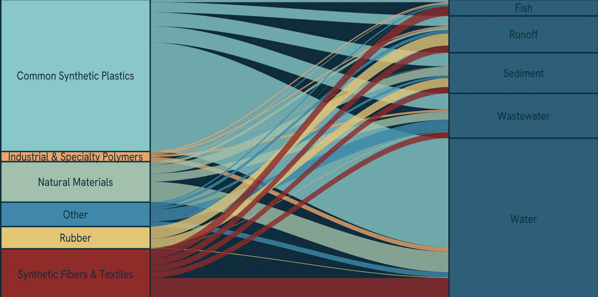
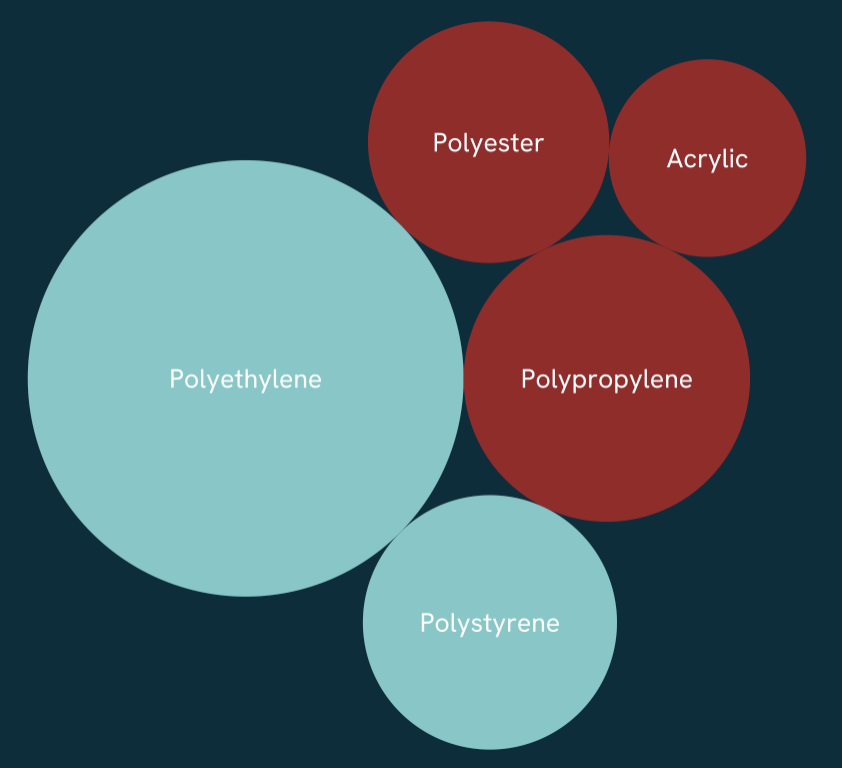
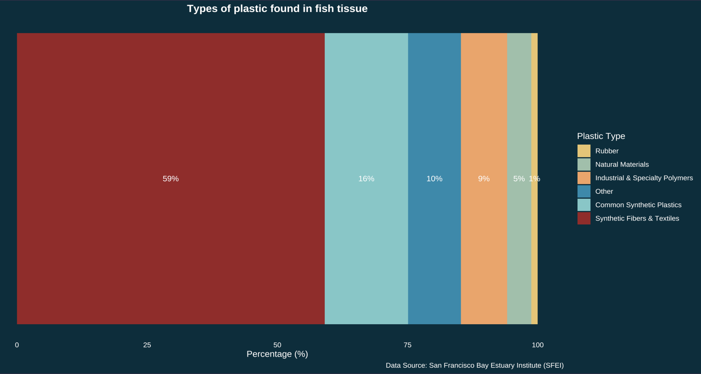
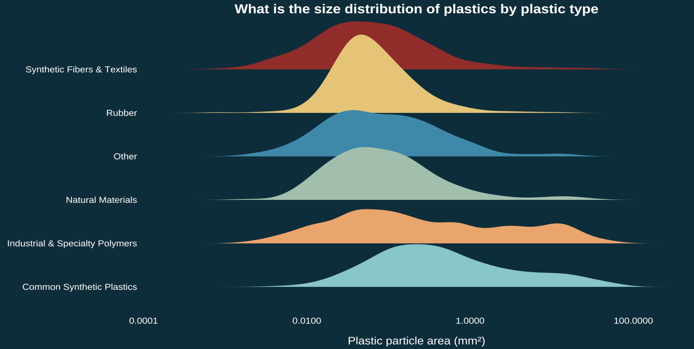

My motivation for this piece started with a simple question: "What do we actually know about plastic pollution in California?" That search led me to a dataset from the San Francisco Estuary Institute, a comprehensive three-year study on microplastic and microparticle pollution in the San Francisco Bay Estuary. I read the executive summary, scrolled through 400+ pages of its associated technical reports, and thought it would be interesting to bring the findings of this study to life.

## The infographic

For my infographic, I wanted to answer the following questions:

*Overarching question*: What are the sources and composition of microplastics in the SF Bay Estuary?

*Additional question 1.* What types of plastic dominate in each sampling environment?

*Additional question 2.* What is the size distribution of microplastic particles across plastic types?

*Additional question 3.* What plastic types are found in fish tissue?

*Additional question 4* What sampling environments had the most microplastics?

{fig-alt="An infographic depicting microplastic pollution with five graphs and associated text."}


## Translating polyethylene into plastic bags

Scientific studies on plastic pollution don't talk about styrofoam, they talk about *polystyrene*. As someone with no background in the technical language of microplastics, one of my biggest challenges was translating dense scientific terminology into something myself and a general audience could understand. This challenge felt worthwhile, after all the San Francisco Bay is one of the most urbanized estuaries in the world, and the people living around it are part of the ecosystem too, contributing to the microplastics of this study.

### Wrangling and re-categorizing

Many of the categories for the data I changed to be more easy to understand for a general audience. This involved regrouping plastic types like *polyester* into *synthetic fibers & textiles*. Below is a snippet of this process.

```{r}
#| eval: false

material_type_refined = case_when(
        plastic_type %in% c(
          "Polyethylene", "Polypropylene", "Polyethylene/polypropylene copolymer",
          "Polystyrene", "Polyethylene terephthalate", "Polyvinyl chloride",
          "Polycarbonate", "Acrylonitrile butadiene styrene", "Polycaprolactone"
        ) ~ "Common Synthetic Plastics",

        plastic_type %in% c(
          "Polyester", "Nylon", "Acrylic", "Polyurethane",
          "Polystyrene/acrylic copolymer"
        ) ~ "Synthetic Fibers & Textiles",

        plastic_type %in% c(
          "Polytetrafluoroethylene", "Polyether block amide", "Poly(Aryletherketone)",
          "Polyvinyl butyral", "Fluoroelastomer", "Ethylene/vinyl acetate copolymer",
          "Polyethylene terephthalate/polyurethane", "Polyethylene co-acrylic acid",
          "Methyl vinyl ether copolymers", "Polyacrolein", "Polyethylenimine",
          "Polyvinyl ether", "Phenolic resin"
        ) ~ "Industrial & Specialty Polymers")
```

## Visual elements

To visualize the findings of this study, I used the technical report as a guide for what to highlight, but I also let the data speak for itself. The goal was five visualizations, each simple enough to stand alone while together telling a complete story about microplastics.

### Alluvial graph

Balancing visual elements was a core challenge, the alluvial plot anchors the center since it demands the most space and interpretation time, with surrounding visuals serving as supporting context. Though I risk the interpretability from the piece alone, I use surrounding text to anchor the message. The alluvial form was intentional: its flowing lines mirror the literal movement of plastic from source to sampling environment. The chart reads left to right, where flow width represents quantity.

{width="70%"}

### Bubble graph

To visualize the raw plastic types found in the Bay, I used a bubble chart via the {packcircles} package. Initially each bubble had a unique color, but as my central argument clarified — that synthetic fibers and common synthetic plastics dominate microplastic pollution — I aligned the colors with the categories used in the alluvial plot for consistency.

{width="50%"}

### Fish bar graph

This piece was originally a bar chart that I then used as a clipping mask in Affinity designer. I always knew I wanted to highlight the plastic pollution impacting fish as someone who eats anchovies caught in the Pacific. I wanted it to feel visceral rather than reduced to another callout stat.

The original bar chart:

{width="70%"}

This was then clipped to the following outline of a Northern Anchovy:

{width="40%"}

### Density graph

The sizes of microplastic may not be of interest to most, however when you consider the magnitude of a problem you can barely see, it is worth highlighting the size. I used a density ridge plot to show the size distribution across plastic types, and there's a happy accident in the form: the ridges themselves could look like accumulating piles of plastic.

{width="60%"}

## Additional details

::: panel-tabset
## Text

**Text:** I used the surrounding text to 1) help clarify the findings of the chart and 2) serve as a legend by coloring the text according to the categories.

## Colors

**Colors:** Much of the data was categorical, so color choices mattered. I originally assigned distinct colors to each sampling environment, but scaled back to three main colors and six colors mapped to plastic type only — reducing visual clutter and keeping the focus where it belongs.


## Typography

**Typography:** The font used in this piece was Hanken Grotesk. I felt that the font was clean, readable even when small and inviting.

## Data Context

**Data Context:** For my infographic, background information about the data was necessary since my focus was the context of the comprehensive study and the associated organizations behind it. I also needed to clarify what exactly defines a microplastic and microparticle. Other data context such as sampling environments needed to be explicit since the original dataset's naming conventions were not as intutitive to a general audience.

## Message

**Message:** This piece aims to convey the scale of microplastic pollution in the San Francisco Bay Estuary. While the study captures only a fraction of the full problem, it offers a window into the everyday items behind it: clothing, packaging, tires. The groupings show how much of each category is present, but the real story is in what those categories represent.

## Accessibility

**Accessibility:** My info graphic is mostly colorblind friendly. I chose to color the two most prominant plastic types - common synthetic plastics and synthetic fibers with colors that have the most contrast.

## DEI

**Diversity, Equity, and Inclusion (DEI):** To ground the piece geographically, I included a map of the San Francisco Bay Area showing the urbanized communities that make up the estuary's watershed. Microplastic pollution doesn't exist in isolation, it reflects the consumption patterns and infrastructure of the people living alongside the Bay, many of whom most vulnerable to its effects.
:::

*All visualizations were made with {ggplot2} and arranged in Affinity designer.*

## The code

```{r}
#| eval: false
#| echo: true
#| code-fold: true

##~~~~~~~~~~~~~~~~~~~~~~~~~~~~~~~~~~~~~~~~~~~~~~~~~~~~~~~~~~~~~~~~~~~~~~~~~~~~~~
##                                                                            --
##--------------------------- #......SET UP......-------------------------------
##                                                                            --
##~~~~~~~~~~~~~~~~~~~~~~~~~~~~~~~~~~~~~~~~~~~~~~~~~~~~~~~~~~~~~~~~~~~~~~~~~~~~~~

library(tidyverse)
library(tidyr)
library(here)
library(dplyr)
library(janitor)
library(readxl)
library(ggplot2)
library(stringr)
library(ggalluvial)
library(ggtext)
library(showtext)
library(glue)
library(packcircles)
library(ARTofR)
library(ggridges)
library(ggforce)

#.......Import data......

micro_plastics <- read_excel(here("posts/microplastics-sf-bay/data/2020-09-11_microparticledata.xlsx")) %>% 
  # Change all columns to lower_snack_case 
  clean_names() 

#.....Clean data with function....
source(here("posts/microplastics-sf-bay/R/clean_data_function.R"))
micro_plastics_clean <- clean_microplastics(micro_plastics)

#.......Fonts.......
font_add_google("Hanken Grotesk", "hanken")

#.....Establish palettes.....
my_pal <- c(
"Other"                                    = "#168aad",
"Common Synthetic Plastics"                = "#76c8c8",
"Industrial & Specialty Polymers"          = "#f4a261",
"Natural Materials"                        = "#99c1a9",
"Rubber"                                   = "#e9c46a",
"Synthetic Fibers & Textiles"              = "#9B2226",
"Unidentified plastic"                     = "#6c757d"
)

plastic_pal <- c(
  "Polyethylene"  = "#76C8C8",  
  "Polypropylene" = "#9B2226",  
  "Polystyrene"   = "#76C8C8",  
  "Polyester"     = "#9B2226",  
  "Acrylic"       = "#9B2226"   
)
#........Enable showtest.....
showtext_auto(enable = TRUE)

##~~~~~~~~~~~~~~~~~~~~~~~~~~~~~~~~~~~~~~~~~~~~~~~~~~~~~~~~~~~~~~~~~~~~~~~~~~~~~~
##                                                                            --
##--------------------------- #......Graphs......-------------------------------
##                                                                            --
##~~~~~~~~~~~~~~~~~~~~~~~~~~~~~~~~~~~~~~~~~~~~~~~~~~~~~~~~~~~~~~~~~~~~~~~~~~~~~~

#........Bubble chart........

# Create top plastics df 
top_plastics <- micro_plastics_clean %>%
# Filter out certain plastics - these are all "natural"
  filter(!plastic_type %in% c("Not Characterized", "Unknown",
                               "Anthropogenic (unknown base)",
                               "Anthropogenic (cellulosic)",
                               "Unknown Potentially Rubber",
                               "Anthropogenic (synthetic)",
                               "Inorganic natural material",
                               "Stearates, Lubricants, Waxes",
                               "Cotton")) %>%
  count(plastic_type, sort = TRUE) %>%
  head(5) %>%
  mutate(circleProgressiveLayout(n, sizetype = "area"),
         label = paste0(plastic_type))

top_plastics_plot <- ggplot(top_plastics, aes(x0 = x, y0 = y)) +
  geom_circle(aes(r = radius, fill = plastic_type), color = NA) +
  geom_text(aes(x = x, y = y, label = label),
            color = "white", family = "hanken", size = 3.5) +
  coord_equal() +
  scale_fill_manual(values = plastic_pal) +
  theme_void() +
  theme(
    legend.position = "none",
    panel.grid.major = element_blank(),
    plot.background = element_rect(fill = "#002d3d", color = NA),
    panel.background = element_rect(fill = "#002d3d", color = NA)
  )

top_plastics_plot

#........Top plastics per sample medium bar chart........
total_n_plastics <- micro_plastics_clean %>%
  filter(!is.na(sample_medium)) %>%
  count(sample_medium, sort = TRUE) %>%
  mutate(
    sample_medium = fct_reorder(sample_medium, n)
  ) %>%
  ggplot(aes(x = sample_medium, y = n)) +
  geom_col(fill = "white") +
  geom_text(aes(label = scales::comma(n)), 
            hjust = -0.2, color = "white", 
            family = "hanken", size = 3.5) +
  labs(x = "Sampling environment", 
       y = "Number of microplastics found", 
       title = "What sampling environments had the most microplastics?",
       caption  = "Data Source: San Francisco Bay Estuary Institute (SFEI)") + 
  scale_y_continuous(expand = expansion(mult = c(0, 0.15))) +
  coord_flip() +
  theme_minimal(base_size = 13) +
  theme(
    legend.position = "none",
    axis.title.y = element_text(color = "white", family = "hanken"),
    axis.text.y  = element_text(color = "white", family = "hanken"),
    plot.title = element_text(color = "white", family = "hanken", face = "bold", hjust = 0.5),
    axis.text = element_text(color = "white", family = "hanken"),
    axis.title.x = element_text(color = "white", family = "hanken"),
    plot.caption = element_text(color = "white", family = "hanken"),
    panel.grid = element_blank(),
    panel.background = element_rect(fill = "#002d3d", color = NA),
    plot.background = element_rect(fill = "#002d3d", color = NA)
  )

total_n_plastics

#........Alluvial graph........
alluvial_plot <- micro_plastics_clean %>%
  filter(material_type_refined != "Unidentified plastic") %>% 
  filter(!is.na(material_type_refined), !is.na(sample_medium)) %>%
  count(sample_medium, material_type_refined) %>%
  # Plot 
  ggplot(aes(axis1 = material_type_refined, axis2 = sample_medium, y = n)) +
  geom_alluvium(aes(fill = material_type_refined),
                alpha = 0.8, 
                curve_type = "cubic") +
  scale_fill_manual(values = my_pal) +
  geom_stratum(aes(fill = material_type_refined), width = 1/3, color = "#002d3d") +
 geom_text(stat = "stratum", aes(label = after_stat(stratum)),
          family = "hanken", color = "#002d3d", size = 3.5) +
  scale_x_discrete(limits = c("Plastic type", "Sample medium"), expand = c(0.12, 0.1)) +
  labs(x = NULL, y = NULL, fill = "Plastic Type", 
       title = "Sources of Microplastics in the San Francisco Bay Estuary",
       subtitle = "Rigid synthetic polymers dominate microplastic composition across all sampling locations.", 
       caption = "Data: San Francisco Bay Estuary Institute") +
  theme_void() +
  theme(
        legend.position = "bottom",
        legend.title = element_text(color = "white", family = "hanken"),
        legend.text = element_text(color = "white", family = "hanken"),
        plot.title = element_text(color = "white", family = "hanken", 
                              face = "bold", 
                              hjust = 0.5),
        plot.subtitle = element_text(color = "white", family = "hanken", hjust = 0.5, size = 9),
        plot.caption = element_text(color = "white", hjust = 1, family = "hanken"), 
        axis.ticks.y = element_blank(),
        axis.text.y = element_blank(),
        axis.title.x = element_text(color = "white", family = "hanken", size = 4),
        panel.grid.major.y = element_blank(), 
        plot.margin = margin(t= 1, r = 1, b =1, l = 1, "cm"), 
        panel.border = element_blank(),
         panel.background = element_rect(fill = "#002d3d", color = NA),
    plot.background = element_rect(fill = "#002d3d", color = NA)
        ) 

alluvial_plot

#........Fish Bar chart.......
fish_pct_plot <- micro_plastics_clean %>%
  filter(sample_medium == "Fish", !is.na(material_type_refined),
         material_type_refined != "Unidentified plastic") %>%
  count(material_type_refined) %>%
mutate(pct = n / sum(n) * 100,
       material_type_refined = fct_reorder(material_type_refined, pct)) %>% 
  ggplot(aes(x = 1, y = pct, fill = material_type_refined)) +
  geom_col() +
  geom_text(aes(label = paste0(round(pct, 0), "%")),
            position = position_stack(vjust = 0.5),
            color = "white", family = "hanken", size = 3.5) +
  scale_fill_manual(values = my_pal) +
  coord_flip() +
  labs(x = NULL, y = "Percentage (%)",
       title = "Types of plastic found in fish tissue",
       fill = "Plastic Type",
       caption = "Data Source: San Francisco Bay Estuary Institute (SFEI)") +
  theme_minimal() +
  theme(
    axis.text.y = element_blank(),
    axis.ticks.y = element_blank(),
    plot.title = element_text(color = "white", family = "hanken", face = "bold", hjust = 0.5),
    axis.text.x = element_text(color = "white", family = "hanken"),
    axis.title.x = element_text(color = "white", family = "hanken"),
    legend.text = element_text(color = "white", family = "hanken"),
    legend.title = element_text(color = "white", family = "hanken"), 
    panel.grid = element_blank(),
    plot.caption = element_text(color = "white", family = "hanken"),
    panel.background = element_rect(fill = "#002d3d", color = NA),
    plot.background = element_rect(fill = "#002d3d", color = NA)
  )

fish_pct_plot

#........Density Ridge plot.......

density_ridge_plot <- micro_plastics_clean %>%
  filter(!is.na(material_type_refined), !is.na(area_mm), area_mm > 0) %>%
  group_by(sample_medium) %>%
  filter(material_type_refined != "Unidentified plastic") %>% 
  filter(n() > 30, area_mm <= quantile(area_mm, 0.95)) %>%
  ungroup() %>%
  ggplot(aes(x = log10(area_mm), y = material_type_refined, fill = material_type_refined)) +
  geom_density_ridges2(alpha = 1, color = NA) +
  scale_fill_manual(values = my_pal) +
  scale_x_continuous(labels = function(x) scales::label_number()(10^x)) +  # convert log back to readable labels
  labs(
    title    = "Which plastics are the largest?",
    #subtitle = subtitle,
    x        = "Plastic particle area (mm²)",
    y        = NULL,
    caption  = "Data Source: San Francisco Bay Estuary Institute (SFEI)"
  ) +
  theme_minimal(base_size = 14) +
  theme(
    axis.text.y  = element_text(color = "white", family = "hanken", size = ),
    axis.title.x = element_text(color = "white", family = "hanken",margin = margin(t = 15)),
    axis.text.x  = element_text(color = "white", family = "hanken", margin = margin(b = 5)),
    plot.caption = element_text(color = "white", family = "hanken"),
    plot.title   = element_text(color = "white", family = "hanken", face = "bold", hjust = 0.5),
    plot.subtitle = element_markdown(color = "white", family = "hanken", hjust = 0.5),
    legend.position = "none",
    panel.grid = element_blank(),
    panel.background = element_rect(fill = "#002d3d", color = NA),
    plot.background  = element_rect(fill = "#002d3d", color = NA)
    )
density_ridge_plot


# Turn off showtext
showtext_auto(enable = FALSE)
```
